# 🏦 DimDimApp - 4º Checkpoint DockerComponse

**Equipe:**
João Paulo Moreira dos Santos — RM 557808
Arthur Bispo de Lima — RM 557568

---

## 📑 Sumário

1. [Introdução](#introdução)
2. [Objetivo](#objetivo)
3. [Requisitos Atendidos](#requisitos-atendidos)
4. [Tecnologias Utilizadas](#tecnologias-utilizadas)
5. [Estrutura do Projeto](#estrutura-do-projeto)
6. [Passo a Passo de Execução](#passo-a-passo-de-execução)
7. [Comandos Docker Utilizados](#comandos-docker-utilizados)
8. [Evidências e Prints do Funcionamento](#evidências-e-prints-do-funcionamento)
9. [Justificativas das Decisões](#justificativas-das-decisões)
10. [Link do Repositório no GitHub](#link-do-repositório-no-github)
11. [Conclusão](#conclusão)

---

## Introdução

Este projeto é uma solução completa para a Instituição Financeira fictícia DimDim, composta por uma API em .NET e um Frontend em Next.js, conectados a um banco PostgreSQL, totalmente conteinerizados com Docker e versionados no GitHub, seguindo rigorosamente o edital do 3º Checkpoint.

---

## Objetivo

Implementar uma solução DevOps de automação, isolamento e persistência de dados, com dois containers (aplicação e banco), Dockerfile personalizado para a aplicação, volume nomeado e rede dedicada, conforme todas as boas práticas exigidas no edital.

---

## Requisitos Atendidos

* [x] Dois containers (API com CRUD e Banco de Dados)
* [x] Volume nomeado para persistência dos dados
* [x] Ambos os containers na mesma rede Docker
* [x] Dockerfile próprio para a aplicação, rodando como usuário não-root
* [x] Utilização de variáveis de ambiente
* [x] Container do banco usando imagem oficial (sem Dockerfile)
* [x] Execução em background com `-d`
* [x] Evidências via `docker exec` (`ls`, `pwd`, `whoami`)
* [x] Código-fonte, Dockerfiles, instruções e prints versionados no GitHub

---

## Tecnologias Utilizadas

* **API:** .NET 8 (C#)
* **Frontend:** Next.js (React)
* **Banco de Dados:** PostgreSQL 16
* **Docker**
* **Git/GitHub**
* **PowerShell/Windows**

---

## Estrutura do Projeto

```plaintext
/Projeto-DimDimApp-CP3
│
├── API/
│   ├── Dockerfile
│   └── ...código da API...
│
├── front-produtos/
│   ├── Dockerfile
│   └── ...código do frontend...
│
├── imagens/
│   ├── banco de dados.png
│   ├── bulddockerfileapi.png
│   ├── bulddockerfilefront.png
│   ├── criacao da rede.png
│   ├── criacao do volume.png
│   ├── dockerps.png
│   ├── run imag api.png
│   ├── run imag front.png
│   └── usuario.png
│
└── README.md
```

## Passo a Passo de Execução

### 1. Clone o repositório

```sh
git clone https://github.com/joao1015/Projeto-DimDimApp-CP3.git
cd Projeto-DimDimApp-CP3
```

### 2. Criação da Rede Docker

```sh
docker network create joaorm557808_rede
```

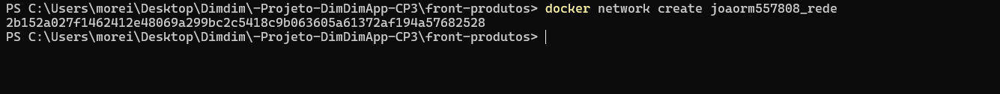

### 3. Criação do Volume Docker

```sh
docker volume create joaorm557808_postgres_data
```

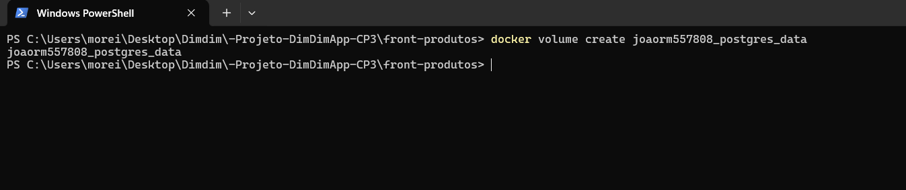

### 4. Build da API (.NET)

```sh
cd API
docker build -t joaorm557808_api .
```

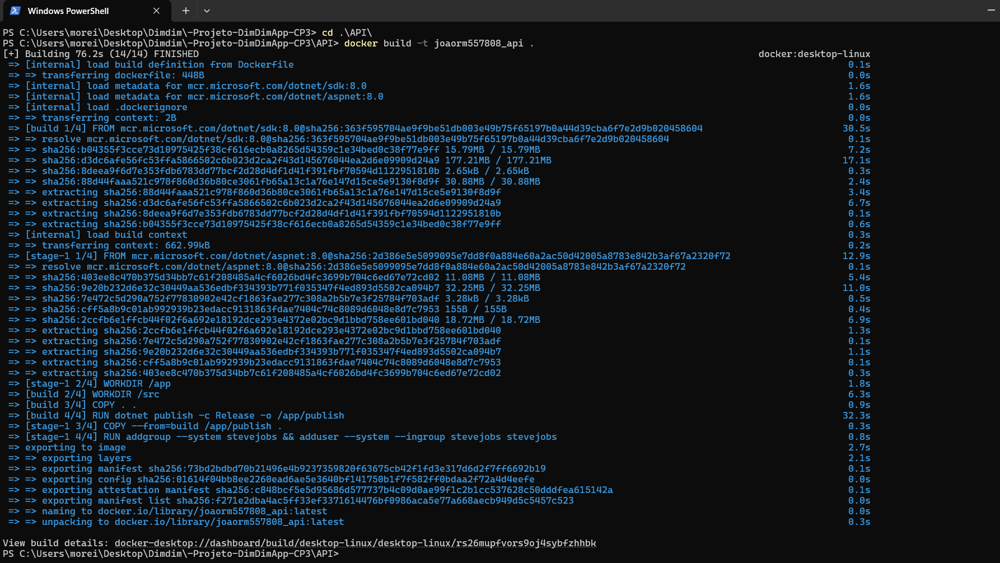

### 5. Build do Frontend (Next.js)

```sh
cd ../front-produtos
docker build -t joaorm557808_front .
```

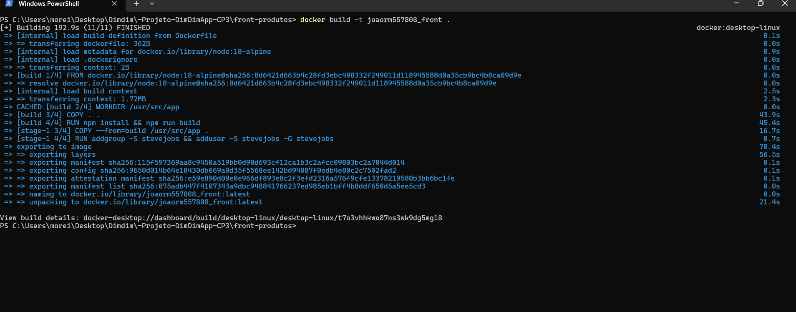

### 6. Execução do Container do Banco de Dados

```sh
docker run -d --name joaorm557808_postgres --network joaorm557808_rede \
  -e POSTGRES_DB=joaorm557808db \
  -e POSTGRES_USER=joaorm557808user \
  -e POSTGRES_PASSWORD=joaorm557808pass \
  -v joaorm557808_postgres_data:/var/lib/postgresql/data \
  -p 5432:5432 postgres:16
```

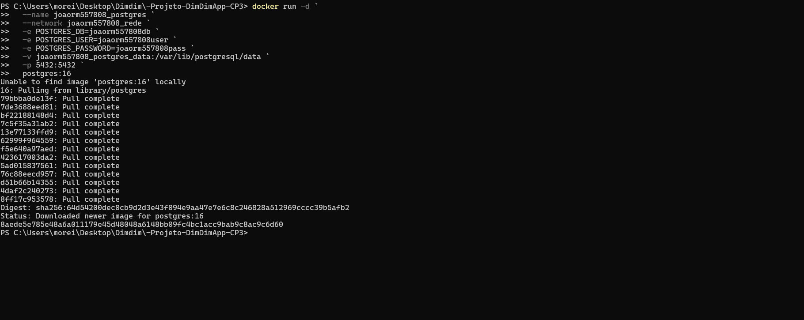

### 7. Execução do Container da API

```sh
docker run -d --name joaorm557808_api --network joaorm557808_rede \
  -e ConnectionStrings__DefaultConnection="Host=joaorm557808_postgres;Database=joaorm557808db;Username=joaorm557808user;Password=joaorm557808pass" \
  -p 5000:5000 joaorm557808_api
```

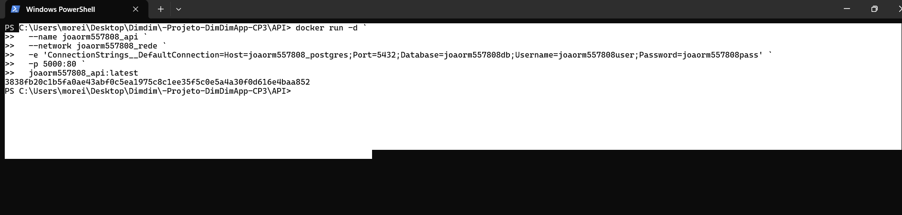

### 8. Execução do Container do Frontend

```sh
docker run -d --name joaorm557808_front --network joaorm557808_rede \
  -e NEXT_PUBLIC_API_BASE="http://joaorm557808_api:5000" \
  -p 3000:3000 joaorm557808_front
```

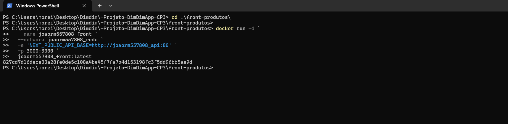

### Containers rodando

```sh
docker ps
```

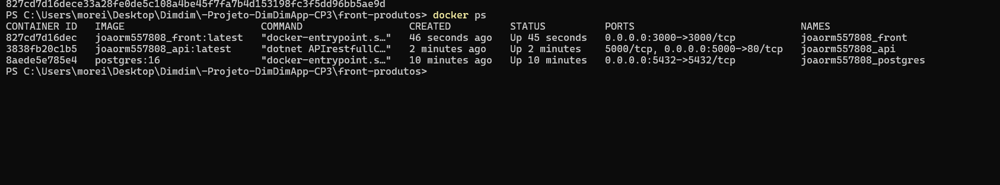

### Acesso ao container da aplicação (usuário não-root)

```docker exec -it joaorm557808_api sh
ls
whoami
```

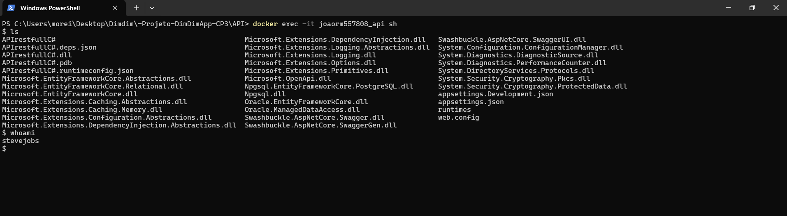

### Listagem das imagens Docker (docker image ls)

```sh
docker image ls
```
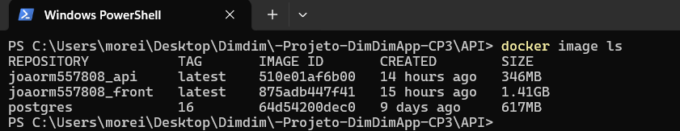


### Listagem das redes (docker network ls)

```sh
docker image ls
```
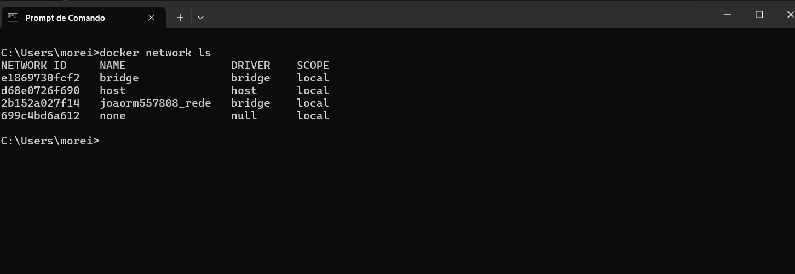


## Justificativas das Decisões

* **Banco:** Imagem oficial PostgreSQL.
* **Volume:** Persistência dos dados garantida.
* **Usuário:** Execução não-root para segurança.
* **CRUD:** Completo e funcional.
* **Docker exec:** Evidências fornecidas.


## Conclusão

O projeto DimDimApp atendeu todos os requisitos, aplicando práticas reais de DevOps, automação, conteinerização e persistência, com documentação detalhada, código versionado e evidências completas do funcionamento.
